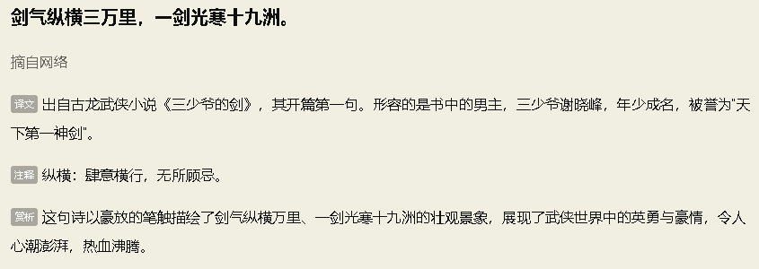

# 不依赖Paddle框架的PaddleOCR


## 简介

这是一个无需安装paddlepaddle框架就可以使用paddleOCR的项目，使用的是PP-OCRv4中文模型。


## 快速开始

### 1. 环境配置
```shell
conda create -n nopaddleocr python=3.10
conda activate nopaddleocr
pip install -r requirements.txt
```
### 2. 初始化
```python
from nopaddleocr import OCR

ocr = OCR('./models')
```
`models`文件夹内应该为:
```
Mode                 LastWriteTime         Length Name
----                 -------------         ------ ----
-a----         2024/8/28     15:48        4745613 det.onnx
-a----         2024/8/28     11:38          32873 ppocr_keys_v1.txt
-a----         2024/8/28     15:44       10831689 rec.onnx  
```
分别为文本检测模型、字典和文本识别模型

### 3. OCR
#### 3.1 多行文本


```python
res = ocr('./multi.png')
print(res)
# Output:
# ['剑气纵横三万里，一剑光寒十九洲。', '摘自网络', '译文出自古龙武侠小说《三少爷的剑》，其开篇第一句。形容的是书中的男主，三少爷谢晓峰，年少成名，被誉为"天', '下第一神剑”。', '注释纵横：肆意横行，无所顾忌。', '赏析这句诗以豪放的笔触描绘了剑气纵横万里、一剑光寒十九洲的壮观景象，展现了武侠世界中的英勇与豪情，令人', '心潮澎拜，热血沸腾。']
```
如果需要获取每条文本的位置，则指定text_only=False
```python
res = ocr('./multi.png', text_only=False)
print(res)
# Output:
# [(((12.0, 9.0), (317.0, 30.0)), '剑气纵横三万里，一剑光寒十九洲。'), (((10.0, 60.0), (76.0, 79.0)), '摘自网络'), (((13.0, 108.0), (835.0, 126.0)), '译文出自古龙武侠小说《三少爷的剑》，其开篇第一句。形容的是书中的男主，三少爷谢晓峰，年少成名，被誉为"天'), (((14.0, 141.0), (104.0, 158.0)), '下第一神剑”。'), (((12.0, 185.0), (245.0, 206.0)), '注释纵横：肆意横行，无所顾忌。'), (((11.0, 231.0), (831.0, 253.0)), '赏析这句诗以豪放的笔触描绘了剑气纵横万里、一剑光寒十九洲的壮观景象，展现了武侠世界中的英勇与豪情，令人'), (((11.0, 267.0), (161.0, 284.0)), '心潮澎拜，热血沸腾。')]
```

#### 3.2 单行文本


```python
res = ocr('./single.png')
print(res)
# Output:
# ['剑气纵横三万里，一剑光寒十九洲。']
```
注意结果始终为一个list

#### 3.3 空图片


```python
res = ocr('./none.png')
print(res)
# Output:
# []
```

### 4. 服务部署

本项目使用Flask搭建了OCR接口，可以方便调用。
```shell
python flask_example.py
#  * Running on http://127.0.0.1:5000
```

```python
import cv2
import base64
import requests


# 1. 读取图片并转换为Base64
def image_to_base64(image_path):
    # 使用 OpenCV 读取图片
    image = cv2.imread(image_path)
    # 将图片编码为 JPEG 格式
    _, buffer = cv2.imencode('.jpg', image)
    # 将编码后的图片转换为Base64
    return base64.b64encode(buffer).decode('utf-8')


# 2. 设置图片路径
image_path = 'single.png'  # 替换为你的图片路径

# 3. 转换图片为Base64格式
base64_image = image_to_base64(image_path)

# 4. 定义接口URL和参数
url = 'http://127.0.0.1:5000/ocr'
params = {'image': base64_image}

# 5. 使用requests发送GET请求
response = requests.get(url, params=params)

# 6. 打印结果
if response.status_code == 200:
    print("Text:", response.json())
else:
    print("Error:", response.status_code, response.text)

```


## 项目说明
 - 仅支持CPU推理


